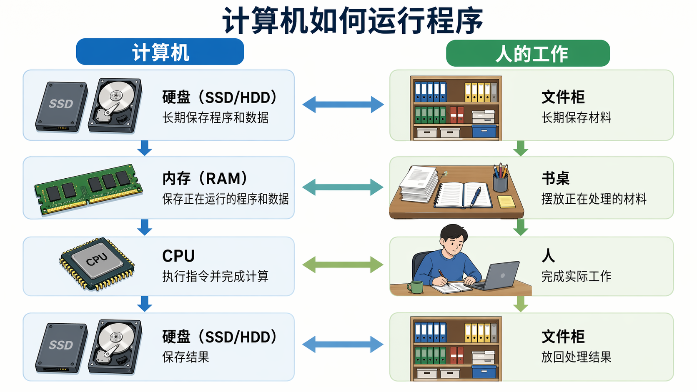
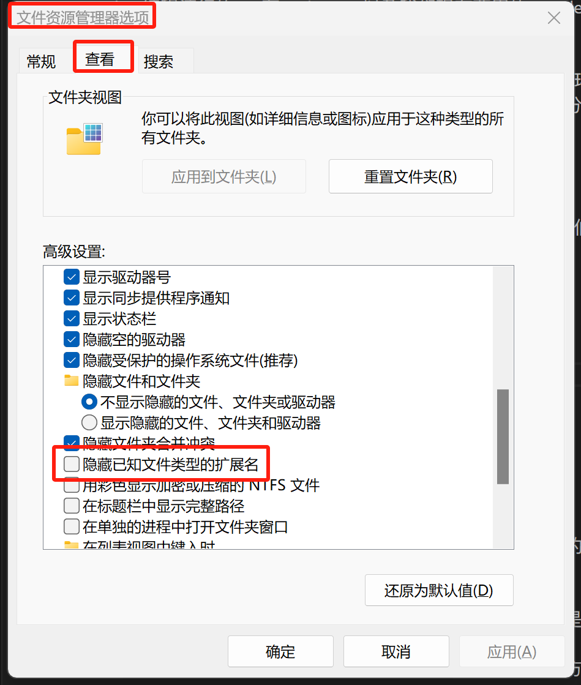
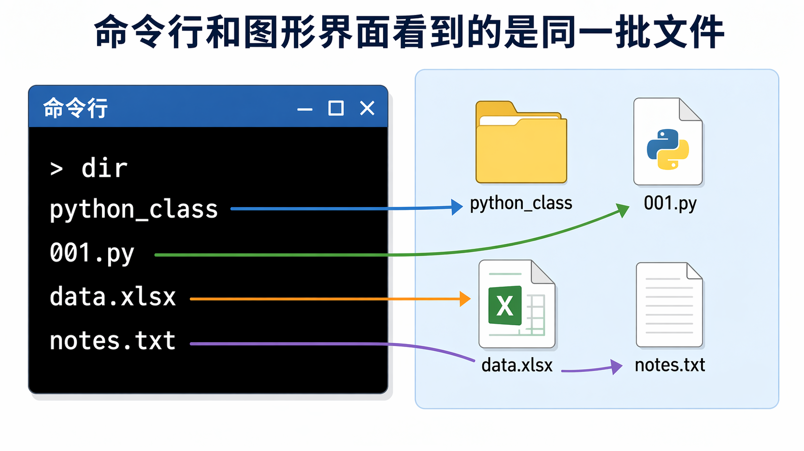

# Plus：计算机系统的基本概念 {.unnumbered}

本节补充一些和编程有关的计算机基础概念。后面使用 VS Code、终端、Python 文件和数据文件时，会反复用到这些概念。

## 重要组件

和编程密切相关的计算机组件，首先需要了解这 3 件：

1. 中央处理器（CPU）
2. 内存（RAM）
3. 硬盘（SSD/HDD）

CPU：负责执行程序指令和完成计算。很多计算任务的速度，主要受 CPU 性能影响。

内存（RAM）：用于保存程序运行时正在使用的数据。优点是速度快；缺点是容量较小，断电后内容会消失。这种“快速、小容量、断电丢失”的存储装置，在手机语境里常称“运行内存”。

笔记本常见 8GB、16GB 或 32GB；手机常见 8GB、12GB 或 16GB。

硬盘（SSD/HDD）：用于长期保存数据。优点是容量大，断电后数据仍然保留；缺点是速度远慢于内存。

PC 语境中，现代电脑多为固态硬盘 SSD（NVMe SSD 更快，SATA SSD 次之）；早期或低端机可能使用机械硬盘 HDD。

手机语境中，常称为“机身存储”或“闪存”，与 PC 的 SSD 同属非易失性存储介质。

例如笔记本硬盘容量常见 512GB、1TB 或 2TB；手机机身存储常见 256GB、512GB 或 1TB。

显然，内存适合保存运行中频繁读写的短期数据；硬盘适合长期保存文件和数据。

如果你看到“16GB + 512GB”或“16GB + 1TB”，通常表示 16GB 内存 + 512GB/1TB 硬盘（或手机机身存储）。

### 移动设备与 SoC

SoC（System on a Chip）会把 CPU、GPU（图形处理器）、内存控制器、通信模块等集成在一颗芯片上。比如高通“骁龙”、苹果“A 系列”都是 SoC 的名称。

苹果用于 Mac 的“M 系列”芯片也属于 SoC。它和较老的 Intel Mac 使用不同的处理器架构，因此安装 Anaconda、VS Code 等软件时，Mac 用户需要区分 M 系列和 Intel 机型。

## 程序运行时发生了什么
{width=100%}

打个比方，你要做某项工作：

1. 工作的时候，你就是 CPU，负责实际处理任务。
2. 硬盘就像柜子，容量大，可以长期保存材料，但取放较慢。
3. 内存就像书桌，空间较小，但处理材料时更方便、更快。

工作过程大致是：

1. 把有关材料从柜子里拿到书桌上：程序和数据从硬盘加载到内存。
2. 在书桌上开始工作：CPU 对内存中的数据进行计算。
3. 工作完毕后，把结果放回柜子里：需要保存的结果写回硬盘。
4. 清理桌面，留出空间给下一项工作：程序结束后释放相关内存。

例如：

1. 读取硬盘：打开 Word 文件、打开游戏时，电脑会把程序和相关数据从硬盘读入内存。游戏启动或读档时常见的进度条，通常就和这个过程有关。
2. 计算和处理：编辑 Word 文件时，电脑会处理你的输入、排版和显示；游戏中角色被怪物打中后扣血，也需要程序根据规则进行计算。
3. 保存结果：Word 文件要保存，结果才会写回硬盘，之后才能交给老师；游戏也需要存档，进度才会保留下来。网游通常会把角色状态自动保存在服务器上，不需要你手动操作，只是游戏替你完成了保存。
4. 清理内存：关闭 Word 或退出游戏后，相关程序占用的内存会被释放出来，留给其他程序使用。

:::: {.columns}

::: {.column width="33%"}
{width=100%}
:::

::: {.column width="33%"}
{width=100%}
:::

::: {.column width="33%"}
{width=100%}
:::

::::


实际过程还会涉及操作系统和其他硬件。这里先保留最重要的理解框架：文件长期保存在硬盘，程序运行时主要使用内存，计算由 CPU 完成。

对数据分析来说，这一点很重要。如果数据文件较大，内存不足会导致程序明显变慢，甚至报错。

## 机房的电脑为什么慢

机房电脑用起来慢，常见原因有两个：

- 内存（RAM）较小（如 4GB/8GB），同时打开的程序一多就不够用，系统会频繁在内存与硬盘之间交换数据，速度明显变慢。
- 如果电脑仍使用 HDD（机械硬盘）而非 SSD，读写文件会更慢，卡顿更明显。

（以上是类比性的说明，有兴趣可继续了解计算机系统原理。）

## 文件、文件夹和扩展名

文件是电脑中保存内容的基本单位。例如，一个 Word 文档、一个 Excel 表格、一张图片、一个 Python 程序，都是文件。

文件夹也称目录，用来存放文件或其他文件夹。课程中经常会说“目录”“文件夹”“工作目录”，它们指的是相近的概念。

判断文件类型，通常看文件名中最后一个英文句点`.`及其之后的内容，这部分称为扩展名。

例如：

1. `report.docx` 是 Word 文档。
2. `data.xlsx` 是 Excel 文件。
3. `photo.jpg` 是图片文件。
4. `notes.txt` 是纯文本文件。
5. `001.py` 是 Python 源代码文件。
6. `analysis.ipynb` 是 Jupyter Notebook 文件。

扩展名只是文件名的一部分，可以被手动修改，所以它未必总是和文件真实内容一致。但对初学者来说，先学会看扩展名非常重要。

### Windows 下显示扩展名

默认情况下，Windows 会隐藏已知文件类型的扩展名。学习编程时，建议把扩展名显示出来，否则容易分不清 `001.py` 和 `001.py.txt`。

在开始菜单，搜索“文件资源管理器选项” -> “查看”页面 -> 去掉“隐藏已知文件类型的扩展名”前面的勾选。

{width=80%}

这样，在资源管理器中就会显示完整文件名。

## 路径和工作目录

路径（path）表示一个文件或文件夹在电脑中的位置。

例如，在 Windows 中，一个文件夹路径可能是：

```text
C:/Users/lee/Desktop/python_class
```

在 macOS 中，一个文件夹路径可能是：

```text
/Users/lee/Desktop/python_class
```

上面两个例子都表示：在用户 `lee` 的桌面上，有一个名为 `python_class` 的文件夹。在你的电脑上，`lee` 会替换成你自己的用户名。

路径既可以指向文件夹，也可以指向具体文件。例如：

```text
C:/Users/lee/Desktop/python_class/001.py
```

这个路径指向 `python_class` 文件夹中的 `001.py` 文件。

### 绝对路径和相对路径

绝对路径从最外层位置写起，可以明确指向某个文件或文件夹。

例如 Windows 下：

```text
C:/Users/lee/Desktop/python_class/001.py
```

macOS 下：

```text
/Users/lee/Desktop/python_class/001.py
```

相对路径不从最外层位置写起，而是从“当前所在的文件夹”开始计算。

假如当前所在的文件夹是：

```text
C:/Users/lee/Desktop
```

那么相对路径：

```text
python_class/001.py
```

就等价于：

```text
C:/Users/lee/Desktop/python_class/001.py
```

### 当前目录和工作目录

终端、VS Code、Python 都会有一个“当前目录”（current directory），也常称为“工作目录”（working directory）。

简单说，当前目录就是程序现在“站在哪个文件夹里”。当你使用相对路径时，系统会从当前目录开始寻找文件。

例如，当前目录是：

```text
C:/Users/lee/Desktop/python_class
```

此时 Python 读取：

```text
data/sales.xlsx
```

实际查找的是：

```text
C:/Users/lee/Desktop/python_class/data/sales.xlsx
```

后面使用 VS Code 时，我们会先打开一个课程文件夹。这个文件夹通常就是本课程的工作目录。建议为课程建立一个专门的文件夹，例如 `python_class`，把代码和数据都放在里面。

### 正斜杠和反斜杠

Windows 路径常见写法是：

```text
C:\Users\lee\Desktop\python_class
```

但在编程语境中，反斜杠`\`有特殊含义，容易造成混淆。因此，本课程表示路径时，统一推荐使用正斜杠`/`：

```text
C:/Users/lee/Desktop/python_class
```

Windows、macOS 和 Python 通常都能识别这种写法。

### 文件夹命名建议

课程文件夹建议使用英文、数字和下划线，不建议使用空格。例如：

```text
python_class
```

不建议写成：

```text
Python class
```

部分工具在处理带空格或中文的路径时容易出错。为减少不必要的问题，初学阶段尽量使用简单的英文路径。

## 终端中的几个基本命令

在命令行（终端）环境下，命令提示符前通常会显示当前路径。

Windows 使用 Anaconda Prompt 或命令提示符，macOS 使用“终端 Terminal”。后面进入 Python 交互环境、运行 `.py` 文件时，都会看到类似界面。

常用命令只需要先掌握几个：

1. 进入某个目录：

```bash
cd 路径
```

例如：

```bash
cd C:/Users/lee/Desktop/python_class
```

2. 进入上一级目录：

```bash
cd ..
```

3. 查看当前目录下有哪些文件：

Windows：

```bash
dir
```

macOS：

```bash
ls
```

这些命令的作用，是帮助你确认自己现在位于哪个文件夹，以及这个文件夹里有哪些文件。

{width=100%}

## 本节要求

### Windows 用户

1. 按前文说明，设置 Windows 显示文件扩展名。
2. 打开 Anaconda Prompt，进入 C 盘根目录，并列出其中的文件夹和文件：

```bash
C:
cd /
dir
```

打开“此电脑”中的 C 盘，对照命令行中 `dir` 显示的内容，看看文件夹和文件名是否一致。

3. 进入自己的桌面目录，并列出其中的文件夹和文件：

```bash
cd %USERPROFILE%/Desktop
dir
```

打开图形界面的“桌面”文件夹，对照命令行中 `dir` 显示的内容，看看两边是否一致。

### Mac 用户

1. 打开“终端 Terminal”，进入自己的桌面目录，并列出其中的文件夹和文件：

```bash
cd ~/Desktop
ls
```

打开 Finder 中的“桌面”，对照终端中 `ls` 显示的内容，看看文件夹和文件名是否一致。

2. 进入应用程序目录，并列出其中的内容：

```bash
cd /Applications
ls
```

打开 Finder 中的“应用程序”，对照终端中 `ls` 显示的内容，看看两边是否一致。

注意：Finder 中显示为“应用程序”，但它对应的系统路径通常是 `/Applications`。
