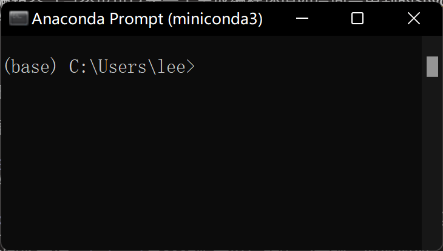
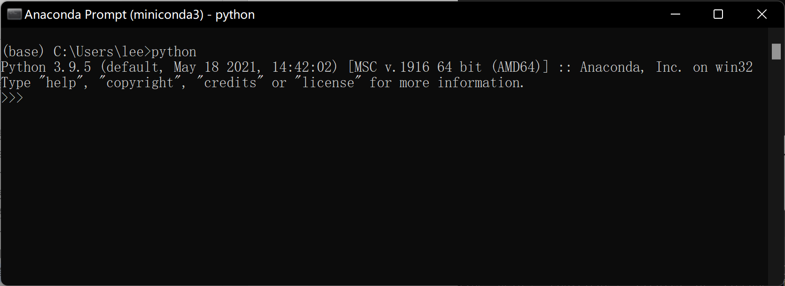
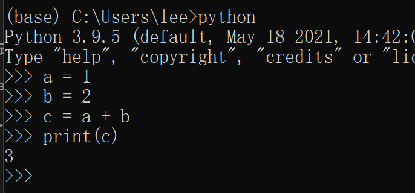

# Python程序的执行

本节主要内容：

- Python 程序与源代码的基本概念
- 在终端进入 Python 交互式环境
- 交互示例：1 + 2 与 `print()`
- 基础概念：变量、运算符、函数
- 退出交互环境并回到命令行

## 一个Python程序是什么

写程序，就是用代码的方式，告诉计算机你要做什么。但处理器听不懂人话，因此你必须用计算机能懂的语言来做这件事。Python就是一种这样的语言。

任何一个程序都是一连串的指令，写一个程序，就是写一连串的指令。那么一个Python程序，就写一连串的Python指令。

一般情况下，我们会把这些指令保存在一个后缀（扩展名）为`.py`的文本文件里。这个文件就像一份菜谱，交给别人后，按步骤执行即可得到结果。

你在一个`.py`文件里写好一连串指令，然后交给Python解释器（Interpreter）（安装Anaconda后就有），解释器会按顺序逐条运行，最终给出结果。

这份“菜谱”（`.py`文件）称为“源代码（source code）”。编程时多数就是编辑并运行这个`.py`文件（数据分析也常用notebook，后面会讲到）。

这个文件本质上和一个`.txt`文件没什么不同，可用任意文本编辑器（如“记事本”或VS Code）打开编辑。

因此，所谓的编程就是：

1. 用文本编辑器（如VS Code，或IDE如PyCharm）新建/编辑`.py`文件。
2. 写入需要的代码。
3. 选择运行方式：一次性运行整个文件，或在交互环境逐步执行。
4. 循环编辑与运行，直至满意。

## Python的交互式环境 {#python_interactive}

我们先采用最基本的Python的交互式环境，给大家一点运行程序的感觉。 

1.	启动 Anaconda Prompt。（macOS/Linux 启动“终端 Terminal”）


2. 我们会看到命令行窗口



1. 输入`python`并回车，进入 Python 交互式环境。

该命令会启动 Python 解释器：你在其中输入的 Python 语句，会被解释器翻译并执行。

<span style="color:red">**注意：**</span>
看到命令提示符`>>>`（三个大于号）表示处于 Python 交互式环境，此时可直接输入并执行 Python 语句。

截图中的 Python 版本为 3.9.5，你的版本可能更高。




### 简单的编程：计算1 + 2 
1. 我们依次输入（每行代码以<回车>结束）

```{python}
#| eval: false
>>> a = 1
>>> b = 2
>>> c = a + b 
>>> print(c)
```

显然，1+2会得到

```{python}
#| eval: false
3
```


2. 结果大致如图




<span style="color:red">**注意：**</span>

* 无法得到结果`3`，首先检查有没有**输入错误（打错字）**。
* `print(c)`中的小括号，是英文括号。在语法层面上的所有符号，都是**英文符号**。
* 如果输入的代码有误、且已回车，直接重新输入正确的代码即可。


### 上述程序中涉及的一些概念


这个涉及程序设计的几个基本概念：

1. 变量和赋值

变量，顾名思义，一个可变的量。编程中变量的概念和代数中的`x`, `y`, `z`基本一样。
Python中，对变量赋值使用1个等号 “`=`”。
	显然， 我们有3个变量，`a`, `b`和`c`。我们把`1`赋予`a`，`2`赋予`b`，把`a + b`的值赋予`c`。

2. 运算符

加减乘除，以及逻辑运算如是否等于，大于，小于等，我们以后会用到。这里只用到“加法”

3. 函数

和数学函数一样，我们调用一个函数，给这个函数传递一个参数，然后这个函数会根据这个参数做一些事情。可能是为你进行一个计算，可能修改某个变量等等，也可能什么都不做。

这里我们调用的函数是`print()`，它会把你传递给它的变量`c`的值打印出来。函数的调用方法是“函数名+小括号”。

**数据分析的程序，大部分情况下可以视为由变量和函数组成。**

### 退出运行环境

输入`exit()`并回车即可（Windows 也可按 Ctrl+Z 后回车，macOS/Linux 可按 Ctrl+D）。

可见，`exit`本身也是一个函数（函数名+小括号），其调用这个函数的作用是退出Python交互式运行环境。


<span style="color:red">**注意：**</span>一定要退出，以便后续的程序能执行。

此时，我们又回到了一开始的命令行（终端）环境中。

常见的命令提示符：Windows 为`>`，macOS/Linux 多为`$`。

1. 可以执行系统中的命令，但不能执行python中的语句！
2. 要进行交互式的python编程，要首先进入[Python的交互式环境](#python_interactive)中！


## 本节要求

1. 在Python的交互环境中计算1+2
