# 使用Visual Studio Code

我们一般不会直接在命令行界面进行编程，
而会利用一个集成编程环境（IDE），
为我们提供文件管理、语法提示、自动补全等等功能。
Python编程流行的IDE有PyCharm，以及我们现在要用的 VS Code 文本编辑器 + Python 相关插件。

这些集成编辑环境，通常会把.py文件的编辑和python的交互环境结合起来，让我们一边编辑py文件的同时，一边执行代码并查看结果。数据分析完毕时，代码同时也写成了。

## 代码的存放

在正式开始之前，选择一个存放代码等等有关文件的文件夹。
为了便于演示，这里选择在桌面上新建一个“python_class”的文件夹，
作为本课程有关代码的存放地点。

<span style="color:red">**注意：** </span> 文件夹的名称最好不要有空格，空格建议用下划线替代，否则可能会产生bug，见[排错：VS Code 执行代码出错](#vscode-errors)

但一般建议选择一个比较好的目录，比如你可能有一个地方是专门用来存放课程的地方（比如在“我的文档”下），
在此位置建立python_class较好。这里选择桌面仅仅是为了方便演示。

<span style="color:red">**注意：** </span> 课程文件夹一般不要放在C盘根目录下，可能有权限问题。

打开 VS Code，选择“文件”→“打开文件夹”，在 VS Code 的资源管理器中我们发现什么都没有。

<span style="color:red">**注意：** </span> 这里要打开整个 `python_class` 文件夹，而不是只打开某一个 `.py` 文件。VS Code 的很多功能都以当前打开的文件夹为基础。

## 建立一个源代码文件

你可以直接在Windows/macOS中建立一个新的文本文件，然后把扩展名改为`.py`，也可以在VS Code中完成。

在VS Code中有2个办法：

1. 选择：菜单：文件，新建文本文件，或者
2. 打开资源管理器（左侧工具栏的第一个图标，点击会弹出当前目录的结构），右键点击空白，新建文件。

都可以建立一个新的文本文件。直接保存，给这个空白文件起一个名字，如“001.py”。
注意，扩展名必须是“.py”。

当你在 VS Code 中编辑一个 `.py` 文件，VS Code 会自动调用所有与 Python 有关的插件。
VS Code 会从一个文本编辑器，成为一个集编辑、运行、调试于一身的 Python 集成开发环境。

当然，你用 VS Code 来写其他语言的代码也可以。

## VS Code 的界面

右上角出现了播放按钮▶，可以把当前文件的代码从头到尾执行一次。

右下角出现了 Python 字样，现在进入了 Python 代码编辑模式。

<span style="color:red">**注意：** </span> VS Code 打开什么文件，就会进入什么模式。如果你的VS Code 没有进入Python代码编辑模式，最大的可能是你还没有打开一个`.py`文件。如果是这样，请先完成上一小节。

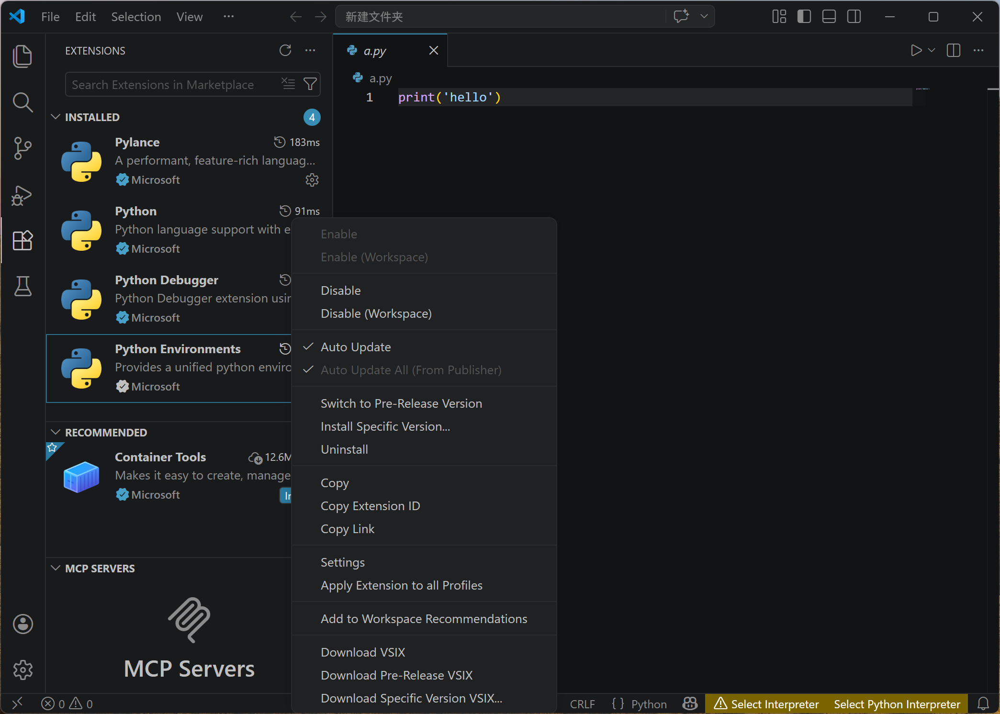

如果右下角出现了<span style="color:red">两个</span>黄色的 “选择解释器” 或 “Select Interpreter” 按钮，说明 VS Code 还没有指定解释器。
这两个按钮中，有一个来自 VS Code 新版本自动安装的 `Python Environments` 插件。
这个插件的功能不是本课程需要掌握的内容，而且会让初学者分不清应该点哪一个。

本课程统一做法：禁用 `Python Environments` 插件。
点击左侧扩展图标，找到 `Python Environments`，点击齿轮图标，选择 `Disable`。

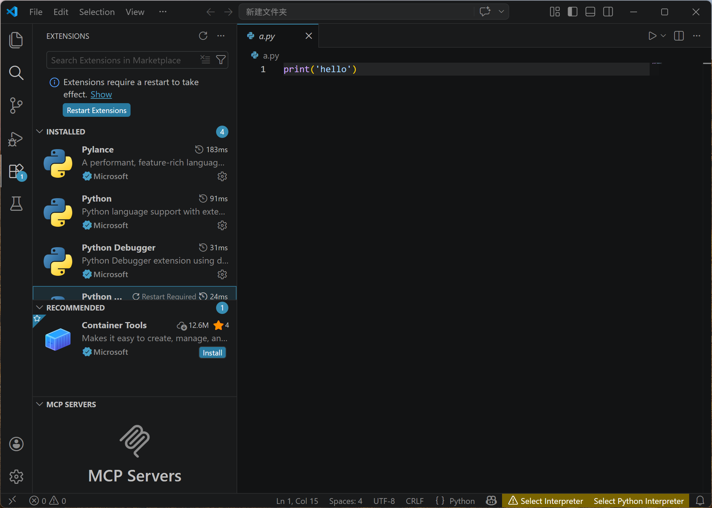

禁用后，点击 `Restart Extensions`，让扩展重启。 如果没弹`Restart Extensions`，关闭 VS Code 再重开也可以。

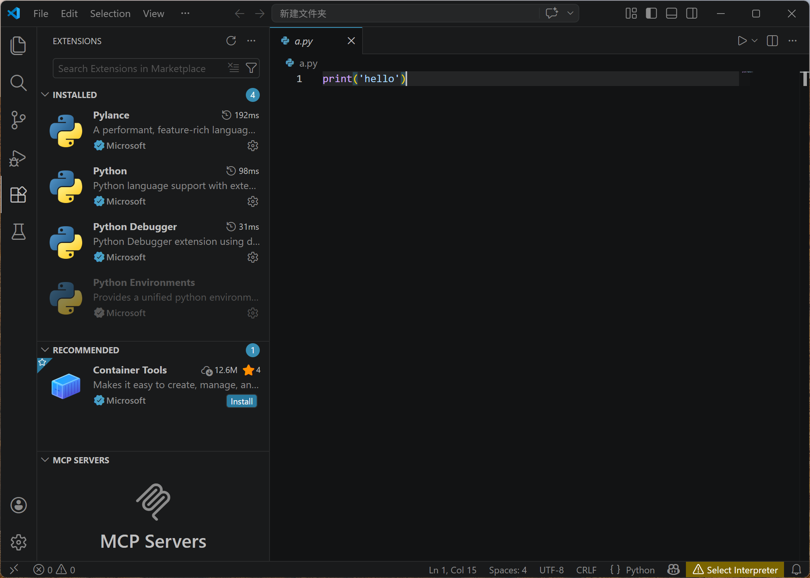

重启后，右下角应该只剩一个黄色的 `Select Interpreter` 按钮。点击这个按钮，选择 Python 解释器。

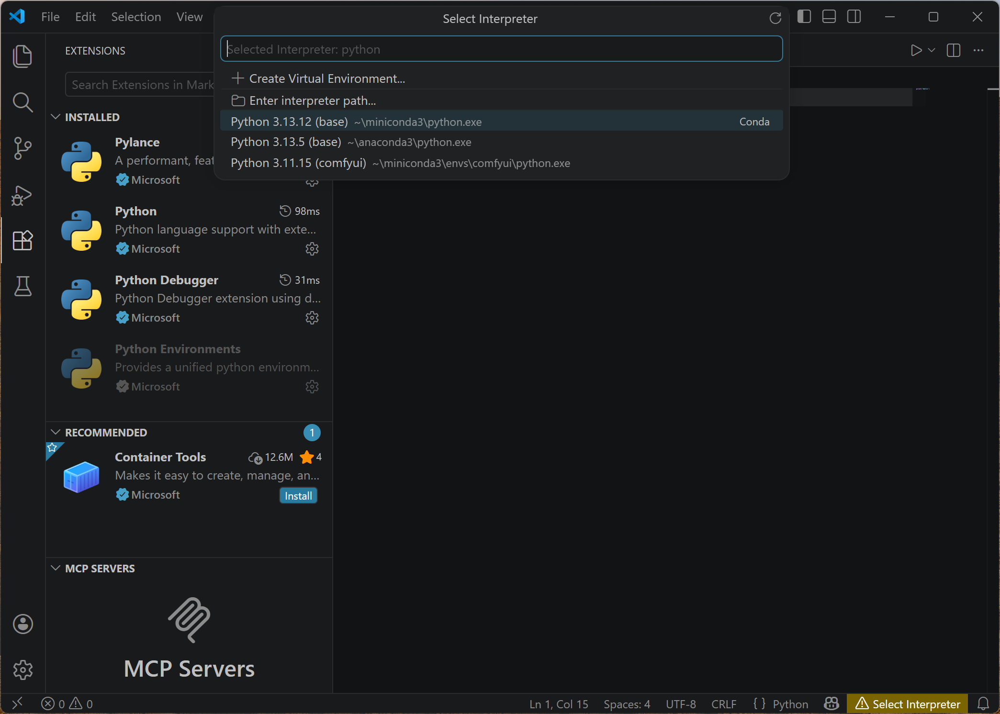

点击之后，如果一切顺利， VS Code 界面的上方会弹出候选解释器列表。
本课程学生端统一使用 Anaconda 默认的 `base` 环境，因此选择带有 `base`、`Conda` 或 `anaconda3` 字样的解释器即可。

例如，在 Windows 上可能是`C:\Users\你的用户名\anaconda3\python.exe`。如果你一开始修改了 Anaconda 的安装路径，比如改到D盘，则可能是 `D:\anaconda3\python.exe`。

（虚拟环境 `env` 相关内容这里不进行深入）

如果第一次没弹出，记得点几下图中的刷新按钮 ↻。

<span style="color:red">**注意：** </span>

1. 如果你在安装 Anaconda 的时候更换了安装路径，这里可能会出现**找不到 Anaconda，进而找不到 Python 解释器**的问题，见下文“排错：VS Code 执行代码出错”部分，或者找老师。
2. 在找不到 Anaconda 的情况下，部分同学会选择让 Windows 系统安装一个 Python，**新手不推荐**。
3. 不要选择 `miniconda`，部分同学会错误地安装了miniconda，**新手不推荐**。

<span style="color:red">**注意：** </span> 任何时候如果 VS Code 找不到解释器，优先看右下角状态栏是否有黄色的“选择解释器”或 “Select Interpreter” 按钮。有的话先点击它，再在顶部弹出的菜单中选择 Anaconda 的 `base` 解释器。若右下角又出现两个选择解释器按钮，先按上面的步骤禁用 `Python Environments` 插件。

## 第一段代码

我们在文件里写入如下代码，保存(ctrl+s)。

下例演示两数相加并打印结果。如果你完全没学过任何编程，应该可以凭直觉看出这段代码的含义。

```{python}
#|eval: false
a = 1
b = 2
c = a + b
print(c)
```

### 预备知识：Python的注释（comment）

先说注释。Python使用井号：`#`来表示注释。所谓注释，就是“**给人看**”的内容，而Python的解释器会直接忽略掉这部分。

1. 注释可以出现在任何地方，注意`#`号只会影响同一行右边的代码，因此也可以出现在行尾。
2. 注释往往也可以用来临时屏蔽一部分代码，只要在代码的最左侧插入一个`#`，那么整行代码会被Python解释器忽略。这是常用技巧。

我们尝试写几个注释，例如：

```{python}
#|eval: false

# 这段代码会计算a和b相加的结果
a = 1
b = 2
c = a + b # 这行代码会计算 a + b

# 下面的代码会把c的值打印出来
print(c)
```


注释是对代码的说明，非常重要：

1.	写代码时间长了，肯定会不记得自己写的内容。有时候上午写的，下午就会忘记。
2.	多人合作的时候，要读懂彼此的代码，也必须有良好的注释。

特别地，**注释是考试的给分点**。你的考试程序输出了正确的结果，可以得到合格评价，同时具有良好的编写风格、合理的注释，才能得到更高分。

## 执行

代码写好了，执行有几种方式。

### Run Python File 按钮 ▶

点击右上角的播放按钮Run Python File，会把当前的py文件，从头到尾执行一次。
你会看到输出了结果`3`。

运行前请先保存文件。如果修改了代码但没有保存，运行结果可能还是旧代码的结果。

如果下方终端先出现红色错误，但后面仍能看到正确结果，通常不是代码错了，而是 VS Code 使用的终端不合适。处理方法见下文“运行整个Python文件报出Conda错误”。

如果程序卡住，或者不再需要当前终端，可以点击垃圾桶图标🗑，关闭这个终端。

一般而言，要把文件从头到尾执行一次，就可以用这种方式。

### 交互执行

如果你要做数据分析之类的任务，需要一边看结果一边写代码，我们会选择交互执行的方式。

使用一种特殊的注释`# %%`（井号，2个百分号，中间可以有空格），一般称为“cell separator”
可以把python代码分成一个一个的cell。试一下：

```{python}
#|eval: false
# %% 
# 对变量a和b进行赋值并打印
a = 1
b = 2
print(a) # 打印a的值
print(b) # 打印b的值

# %%
# 计算c的值并打印
c = a + b
print(c) # 打印c的值

```

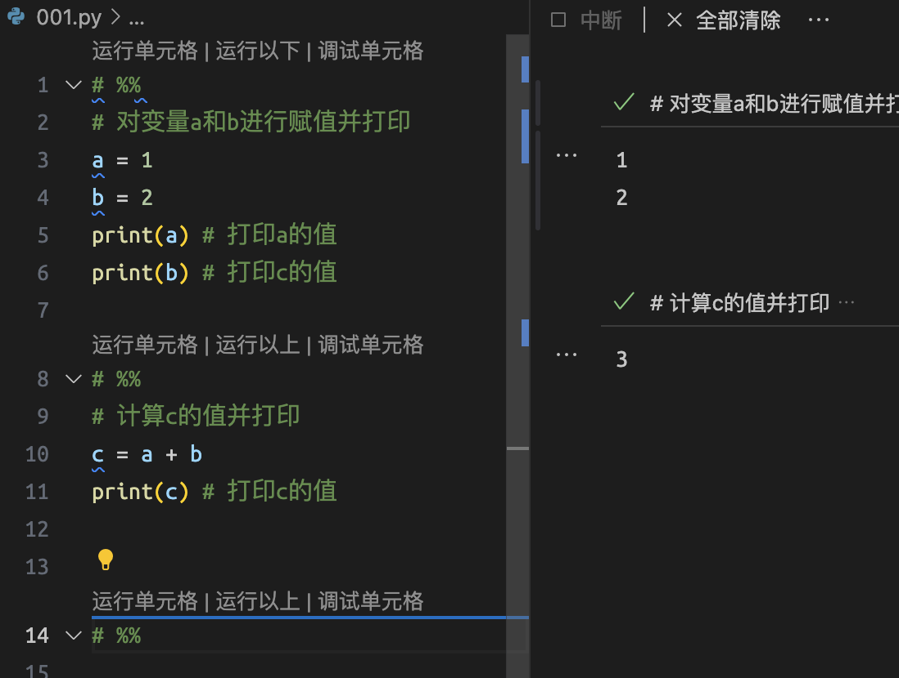

`# %%` cell separator 把代码切成了一块一块：两行 separator 中间的部分，被视为一个 cell。

按 cell 运行本质上使用的是 VS Code 的 Jupyter 功能。第一次启动时，可能会看到 Jupyter、Kernel 或 Python Interactive Window 等字样，稍等一会儿即可。

我们点击第一个run cell，交互窗口只会执行第一个cell，即1到6行的代码。

这一块代码会打印出变量`a`和`b`的值。

点开交互窗口上的省略号，可以看到这个cell具体执行了什么代码。

同理，点击第二个run cell会执行下一块代码，计算a+b并打印c。

如果直接运行第二个 cell，可能会报 `NameError`，这是因为变量 `a` 和 `b` 还没有在当前交互会话中创建。先运行前面的赋值 cell，再运行后面的计算 cell 即可。

但一般我们用快捷键：

通常可以用 Ctrl+Enter 执行当前 cell，用 Shift+Enter 执行当前 cell 并跳到下一个 cell。不同系统和版本的快捷键可能略有差异，以 VS Code 界面上的提示为准。

所以，你可以按住Shift，连续按回车，就可以一个cell一个cell往下执行。

这在进行数据分析的时候会用很多。

单步执行和debug会在后面专门说。

特别地，在交互执行下，每个 cell 的最后一行的结果会自动显示。
如果只是查看变量的值，这可以让我们少打一个 `print()` 或 `display()`。
注意这只在交互模式下生效。

交互运行会保留前面已经运行过的变量。如果反复修改代码后结果很奇怪，可以重启 Kernel 或关闭当前交互窗口，再从第一个 cell 开始重新运行。

尝试：把上述代码的`print(a)`和`print(b)`改写。

<span style="color:red">**注意：** </span> 如果你的 Anaconda 安装路径中有中文（例如你的用户名是中文），可能运行报 `Bad file descriptor` 错误，见下文“排错：VS Code 执行代码出错”部分，或者找老师。

### 变量表

在交互执行的过程中，可在右侧的 Variables 面板查看当前会话中的变量信息。
只有使用 cell 或交互方式运行后，这里才会显示当前会话的变量；直接用 Run Python File 运行整个文件，通常不会留下可查看的变量会话。

### 脱离 VS Code 执行

Python 本身是一个独立的可执行程序，和 VS Code 并无关系。这个可执行程序即所谓“解释器”，
会把源代码从第一行执行到最后一行一次。

因此，你只要告诉 Python 你要执行哪个 .py 文件即可。

这个一般教程会放在第一部分，但以我们的任务更多是要交互执行，这里只简单演示一下。

在你的 Anaconda Prompt 或终端中，进入你刚才新建的 python_class 目录。

```{python}
#|eval: false
python 001.py
```

结果是一样的。

实际上，右上角的播放按钮，做的是同样的事：等价于在已激活的环境中进入工作目录并执行 `python 001.py`，只是把多个步骤合并成一个按钮。

## 本节要求

1. 创建一个用来专门存放本课程代码和数据的文件夹（称为工程目录），如果图省事就在桌面上建立（但不推荐）
2. 在上述工程目录中建立一个.py文件，计算上述的 1+2的代码，包括使用“运行Python文件”和“按单元格运行” 两种方式。（这里可能会遇到一大堆问题）

<span style="color:red">**注意：** </span>

1. 安装和配置编程环境是文科同学学习编程的第一个大障碍，过了这一关，后面就会顺利起来。
2. 历届都有小部分同学一直卡在安装过程，最多的能卡半个学期，因此不要犹豫，搞不定找老师。

## 排错：VS Code 执行代码出错 {#vscode-errors}

### 运行整个Python文件无结果且无错误提示

点击“运行 Python 文件”按钮后，VS Code下方的命令行终端可以正常弹出，但是不显示任何结果，或者闪过一行命令后直接结束。

可能会闪过类似这样的命令：

```
conda run --live-stream --name base python d:/Python class/001.py
```

这是因为你的目录路径有空格，例如上例中的“d:/Python class”。在部分旧版本或特定终端配置下，Windows 的终端可能会把空格前面的部分视为你要执行的命令，如：

```
conda run --live-stream --name base python d:/Python
```

显然这不是你的.py文件的路径。

解决办法：把你的工作文件夹的中空格去掉 或者改为下划线`_`即可，如讲义的范例`python_class`。

### 运行整个Python文件报出Conda错误


点击“运行 Python 文件”按钮后，VS Code下方的命令行终端可以正常弹出，但会弹出红字错误提示：

```
conda : 无法将“conda”项识别为 cmdlet、函数、脚本文件或可运行程序的名称。请检查名称的拼写，如果包括路径，请确保路径正确
```

或者

```
&:无法加载文件 c:\users\*\anaconda3\shell\condabin\conda-hook.ps1，因为在此系统上禁止运行脚本。
```

有时，终端前面虽然报了红色错误，后面仍然能看到正确结果。
这通常不是 Python 代码写错了，而是 VS Code 当前使用的 PowerShell 不能正常执行 conda 相关命令。
为统一课堂环境，我们把 VS Code 的默认终端改为 cmd。

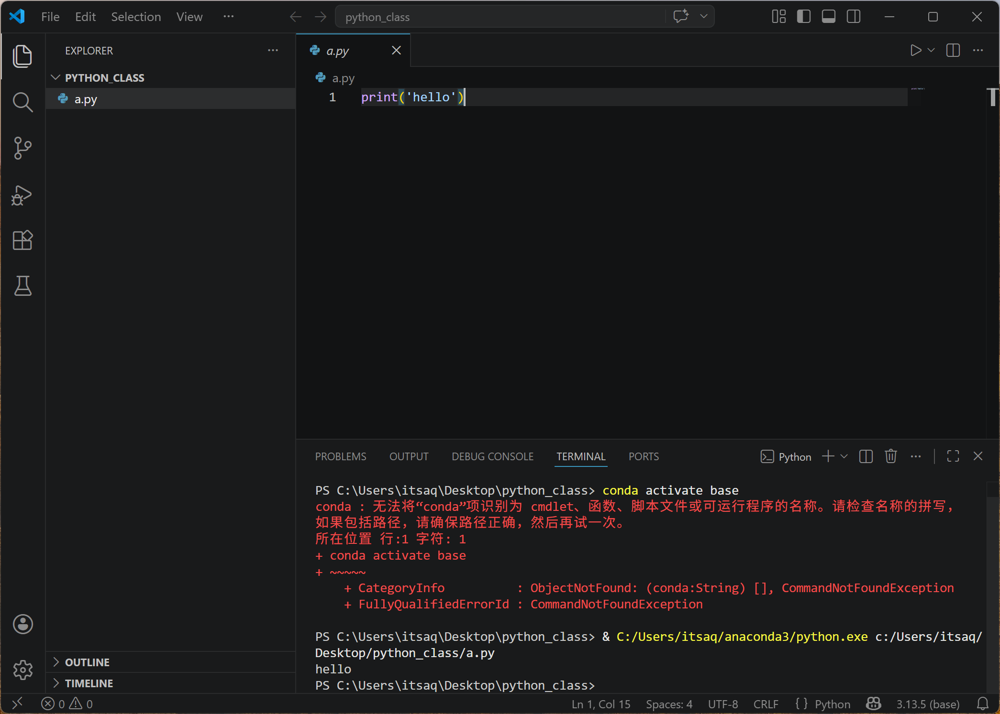

1. 点击左下角齿轮图标，选择“设置”
2. 在搜索框中输入“terminal windows”
3. 选择“Command Prompt”

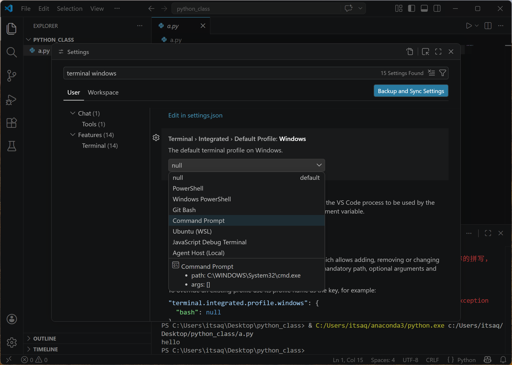

如果下方已经打开了旧终端，可以点击垃圾桶图标关闭它，再点击右上角的运行按钮。

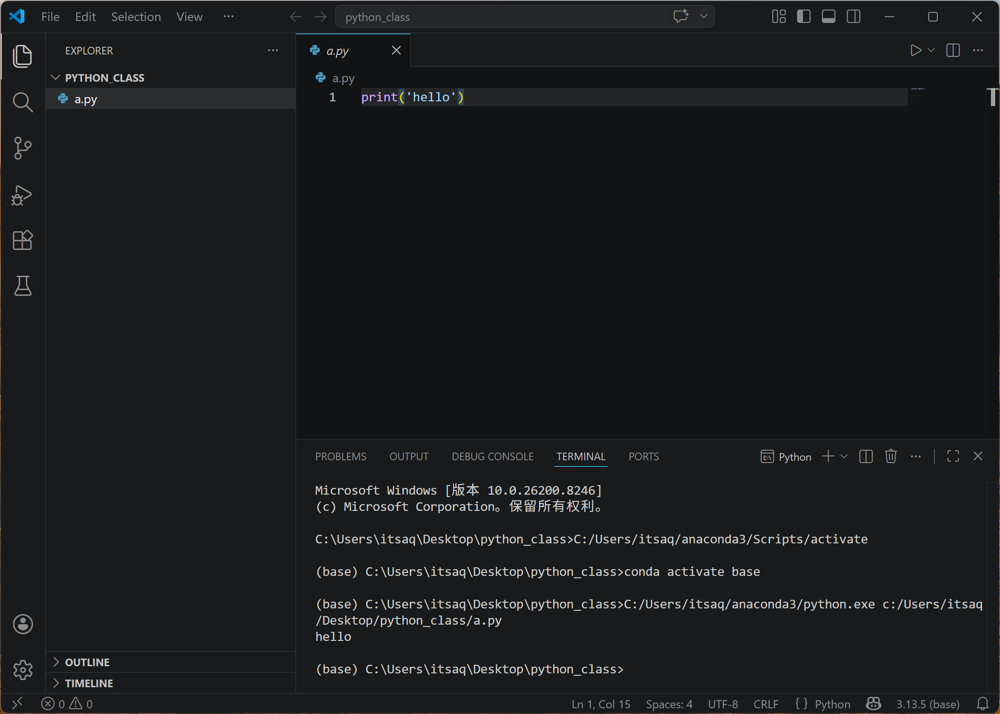

再点击“运行 Python 文件”按钮后，应该不会再报错。

### 运行单元格(run cell)出现 Bad file descriptor 错误

如果你用的是Windows，且你的用户名是中文，那么用vs code的run cell运行，可能会出现如下错误：

（示例截图：这是某位同学的笔记本电脑，请大家要经常清理自己电脑的屏幕）

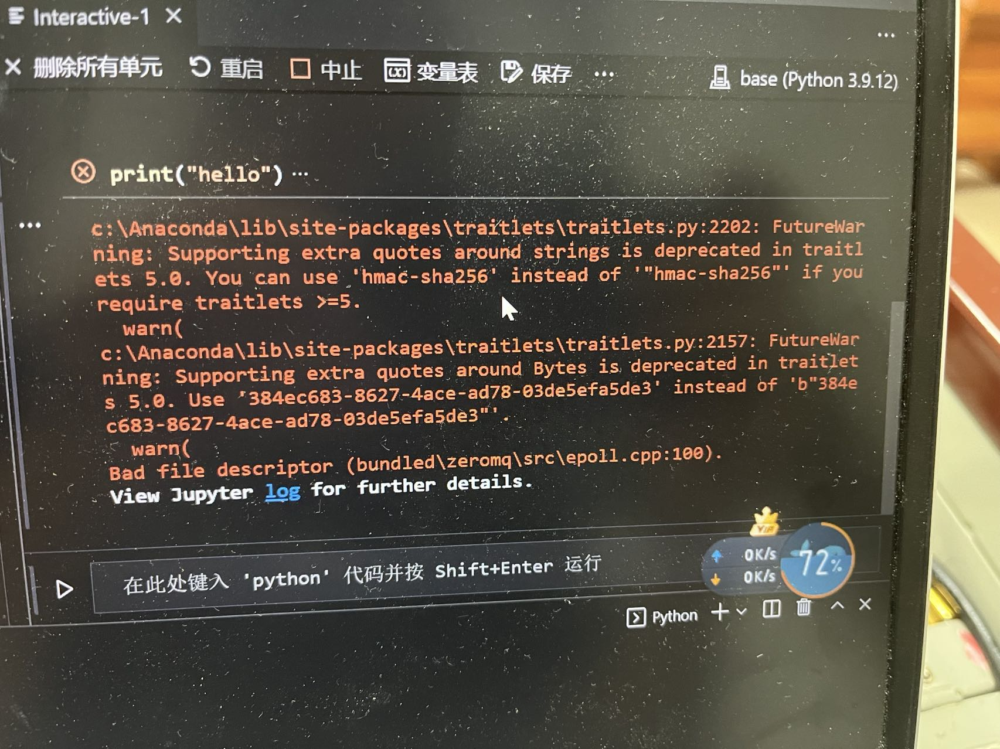

注意最后一行

```
Bad file descriptor (bundled\zeromq\src\epoll.cpp:100)
```

这个问题可能与中文用户名有关，某个组件（pyzmq）在部分版本中处理中文路径会出错。先按前面的方法确认 VS Code 已经选择了 Anaconda 的 `base` 解释器，再尝试下面的方法。

**方法1：改环境变量**

在 Windows 菜单中选择“编辑系统环境变量”

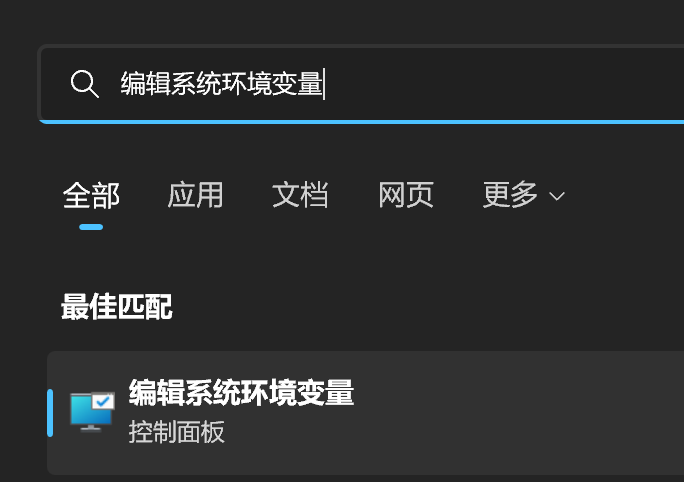{width=60%}

在弹出的窗口中选择最下方的“环境变量(N)”

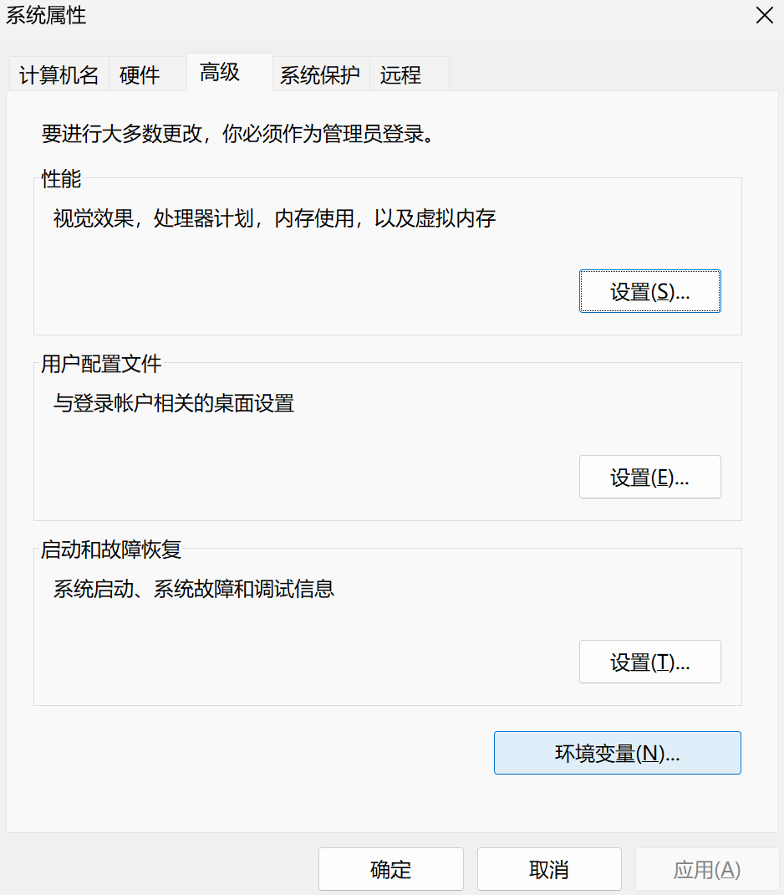{width=60%}

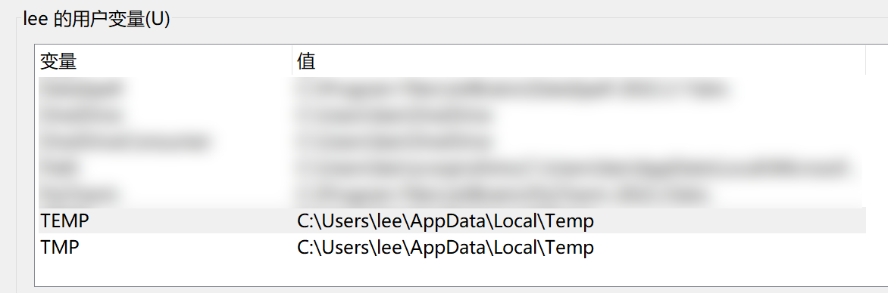{width=60%}

可见最下方有`TEMP`和`TMP`2个环境变量（临时文件所在目录）。双击2个环境变量，都改为`C:\Temp`。
修改前先确认 `C:\Temp` 这个文件夹已经存在。如果没有，就先在 C 盘新建一个名为 `Temp` 的文件夹。

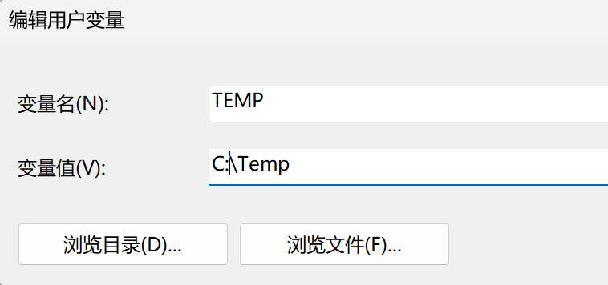{width=60%}

最终如图。

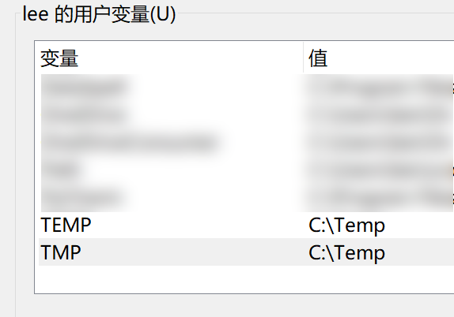{width=60%}


重启电脑即可。

**方法2：调整 pyzmq 版本（备选）**

降级 pyzmq 是一个很古老的方法，不建议一开始就使用。
优先更新 VS Code 的 Python/Jupyter 扩展，并确认右下角已经选择 Anaconda 的 `base` 解释器。
若仍报错，再更新 pyzmq 到与当前 Python 版本兼容的稳定版本。

进入 Anaconda Prompt（见前一章），依次执行：

```
python -m pip install -U pyzmq <回车>
```
重启 VS Code 即可。

如果上述方法仍然无效，再找老师现场处理。不要自己随意降级到很旧的 pyzmq 版本，因为旧版本可能与当前 Anaconda 自带的 Python 不兼容。


### VS Code 找不到 Anaconda 的解释器

如果点击 `Select Interpreter` 后，列表中没有 Anaconda 的 `base` 解释器，不要安装新的 Python，也不要选择 Windows 自动推荐的 Python。
这里的问题通常不是 Anaconda 没装好，而是 VS Code 没有自动识别到它。

先在解释器列表中多点几次右上角的刷新按钮 ↻。
如果仍然没有，选择 `Enter interpreter path...`，手动找到 Anaconda 的 `python.exe`。

常见位置如下：

- 默认安装：`C:\Users\你的用户名\anaconda3\python.exe`
- 安装到 D 盘：`D:\anaconda3\python.exe`

选中这个 `python.exe` 后，右下角应该显示类似 `base`、`Conda` 或 `anaconda3` 的字样。
之后再点击右上角运行按钮。

如果手动选择 `python.exe` 后仍然找不到或运行异常，再到 VS Code 设置中搜索 `conda`：

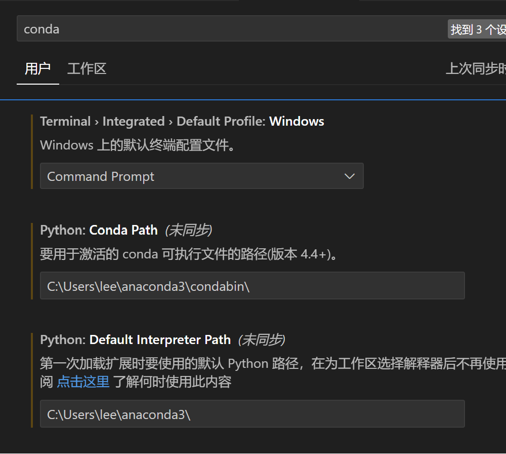{width=80%}

需要时可以填写：

1. `Conda Path`：指向 Conda 程序。例如安装在 `D:\anaconda3` 时，可填写 `D:\anaconda3\condabin\conda.bat`，或 `D:\anaconda3\Scripts\conda.exe`。
2. `Default Interpreter Path`：指向 Python 解释器。例如 `D:\anaconda3\python.exe`。

设置后重启 VS Code，再按前面的步骤选择 Anaconda 的 `base` 解释器。


